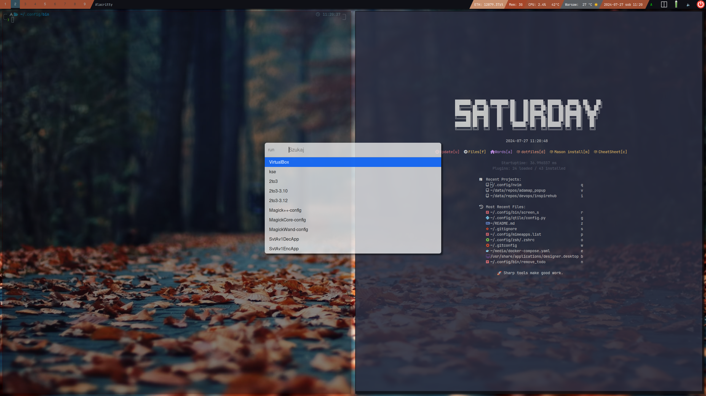

### My dot files

* nvim
* zathura
* dmenu
* ranger
* multidisplay qtile setup with displays detection
* custom todo's system
* custom zsh based on p10k
* autotheme generation on wallpaper change with pywal
* mimetypes

